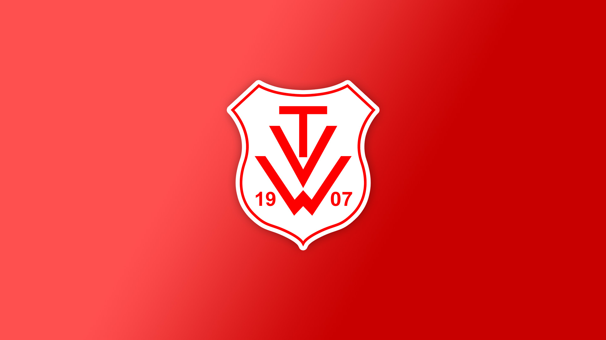
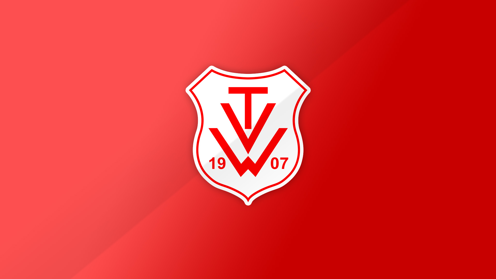
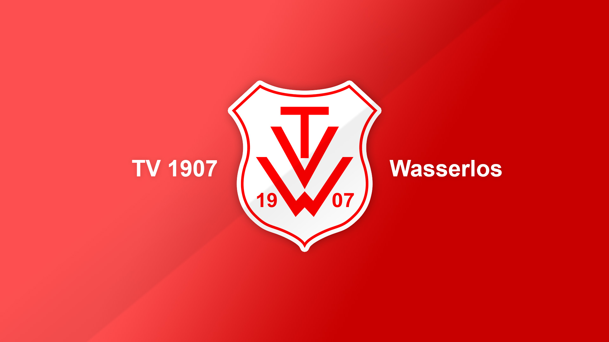

# TV Wasserlos Vereinswappen
Dieses Repository beinhaltet das vektorisierte Vereinswappen des TV Wasserlos e.V., sowie Entwürfe zum Druck von Fahnen.
Vektorisiert von cyberkeiler und FredBurton.

## Wappen einzeln

## Facebook Profilbilder

## Bildschirmhintergrund

## Homepage Layout
Testseite: [hier](https://tvw.terramultimedia.de)
